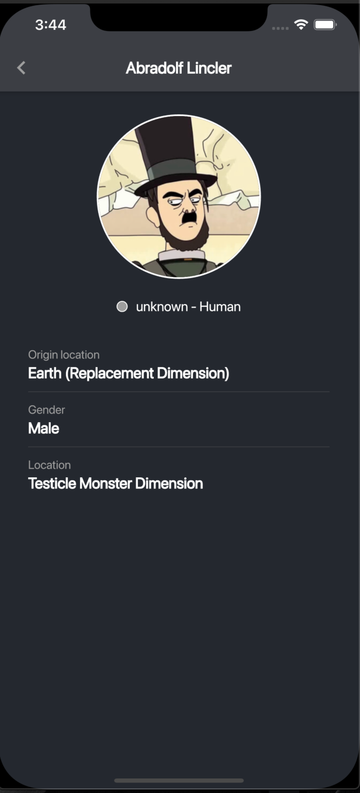
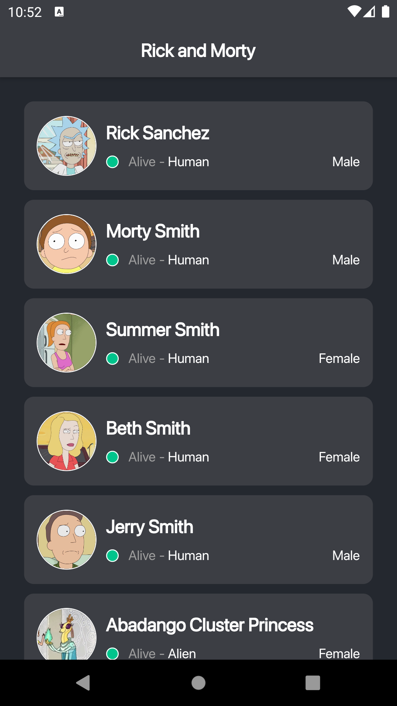
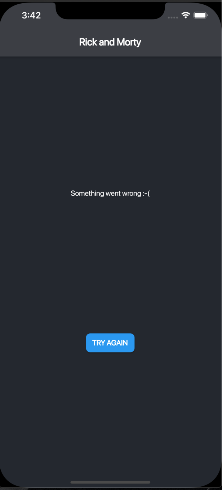
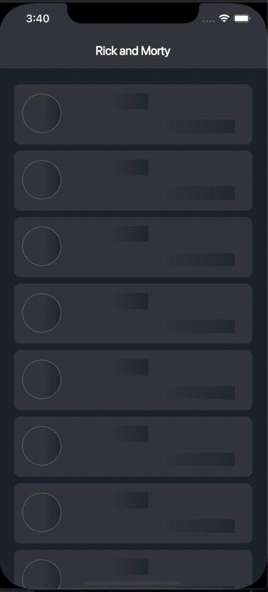
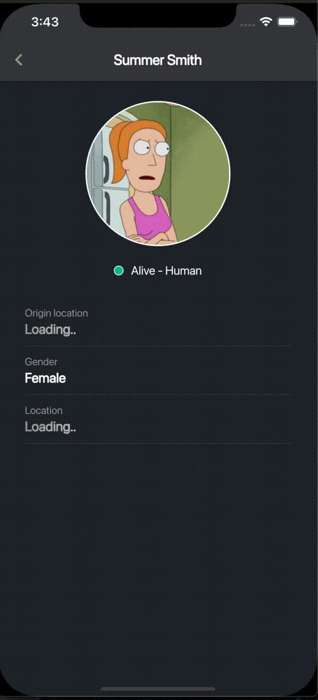

# Testorium

Этот проект является эталонным шаблоном для нового приложения.

 <ul>
  <li>internationalization</li>
  <li>routing (auto_route)</li>
  <li>bloc, get_it</li>
  <li>themes changing on the fly</li>
  <li>fonts</li>
  <li>shimmer effect while loading</li>
</ul> 

To do:

 <ul>
  <li>add bottom bar</li>
  <li>add connectivity check</li>
  <li>add permissions check</li>
</ul> 

